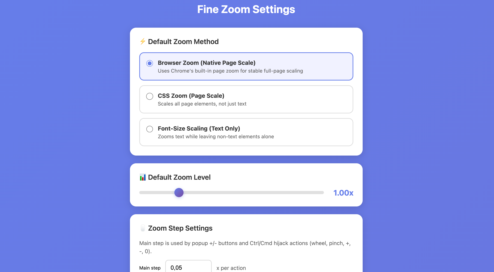

# Fine Zoom

[](https://github.com/Madmanden/fine-zoom/actions/workflows/ci.yml)
[](https://github.com/Madmanden/fine-zoom/tags)
[](#license)

Fine Zoom is a Manifest V3 browser extension for Chromium browsers that gives you exact zoom control instead of coarse built-in presets. It supports native tab zoom, text-only scaling, and CSS-based page scaling, with per-site memory and fast control from the popup, wheel, and keyboard shortcuts.

Not yet published on the Chrome Web Store. Install manually through `chrome://extensions/` using `Load unpacked`.

## Screenshot



The screenshot above shows the settings page, including default zoom controls and the per-site overrides list.

## Features

- Exact zoom levels with three modes:
  - `browser-zoom` (default): native tab zoom via Chrome APIs
  - `font-size`: text-only scaling using computed font-size overrides
  - `css-zoom`: full-page scaling using CSS `zoom`
- Per-site overrides for both zoom level and zoom method
- Live slider preview while dragging in the popup
- Main `+` / `-` controls with configurable step size
- Fine adjustment controls with `0.01` increments
- Optional Ctrl/Cmd+Wheel and Ctrl/Cmd key hijacks on supported pages
- Excluded-sites list for domains where zoom should stay untouched

## Installation

### Load unpacked in Chrome

1. Clone this repository.
2. Open `chrome://extensions/`.
3. Enable Developer mode.
4. Click `Load unpacked`.
5. Select this project directory.

## Usage

### Popup controls

1. Click the extension icon.
2. Choose a zoom method.
3. Adjust the level:
   - The slider uses a fixed `0.05` step.
   - Main `+` / `-` buttons use your configured popup step, defaulting to `0.05`.
   - Fine `+` / `-` buttons use a fixed `0.01`.
   - `Ctrl/Cmd+MouseWheel` and trackpad pinch gestures on supported pages use your configured main step.
   - `Ctrl/Cmd +`, `Ctrl/Cmd -`, and `Ctrl/Cmd 0` are intercepted on supported pages.
4. Click `Reset` to return to the default level.

### Settings page

Open settings from the popup to manage defaults and saved overrides.

Available settings include:
- default method
- default zoom level
- popup button step
- per-site overrides
- excluded sites
- toggle for Ctrl/Cmd+Wheel hijack
- toggle for Ctrl/Cmd key hijack

The per-site list only shows entries that differ from your current defaults, so it stays focused on real overrides instead of every saved site.

## How It Works

- Background worker applies and persists zoom state.
- Content scripts handle CSS-based methods at `document_start`.
- Native mode uses `chrome.tabs.setZoom()` and `chrome.tabs.getZoom()`.
- Site-specific settings are stored in `chrome.storage.local`.
- In browser-zoom mode, manual native browser zoom changes are synchronized into extension state.
- Native zoom is only re-applied when the target value differs, reducing repeated zoom popups on navigation.
- Ctrl/Cmd+Wheel is intercepted in the content script and routed to the background worker for apply + persistence.
- Ctrl/Cmd key zoom shortcuts are intercepted in the content script and routed to the background worker for apply + persistence.

## Storage Keys

- `defaultMethod`
- `defaultLevel`
- `defaultPopupButtonStep`
- `perSiteZoom`
- `excludedSites`
- `enableCtrlWheelHijack`
- `enableCtrlKeyHijack`
- `didMigrateMainButtonStepTo005`

Migration flags:
- `didMigrateToBrowserZoomDefault`

## Permissions

- `storage`: save local preferences on-device
- `tabs`: read and apply native tab zoom
- `scripting`: execute zoom scripts on pages when needed
- `<all_urls>` host permission: allow zoom logic to run on visited web pages

## Compatibility Notes

- Designed for Chromium browsers (Manifest V3).
- `css-zoom` uses non-standard CSS `zoom`; behavior may vary across browsers.
- Native zoom cleanup skips restricted and error pages that cannot be scripted.
- Ctrl/Cmd+Wheel hijack only applies where content scripts run (`http/https` pages). Restricted pages keep native browser behavior.
- Ctrl/Cmd key hijack only applies where content scripts run (`http/https` pages). Restricted pages keep native browser behavior.
- Trackpad pinch events are browser-dependent; Fine Zoom applies best-effort remapping and behavior may vary by browser/page.

## Project Structure

```text
.
├── background.js
├── manifest.json
├── content/
│   ├── content.js
│   └── zoom-methods.js
├── popup/
│   ├── popup.html
│   ├── popup.css
│   └── popup.js
├── settings/
│   ├── settings.html
│   ├── settings.css
│   └── settings.js
├── screenshots/
│   └── Screenshot.png
├── shared/
│   ├── constants.js
│   └── utils.js
└── test-logic.js
```

## Development

Run basic logic tests:

```bash
node test-logic.js
```

## Privacy

Fine Zoom does not collect, store, or transmit personal data.
The extension modifies text size locally in your browser.
Settings are stored locally using Chrome storage (`chrome.storage.local`) and never leave your device.
The extension requires page access only to apply zoom behavior on visited pages.

## Chrome Web Store Listing Notes

- Required icons included: `16x16`, `48x48`, `128x128`
- Listing requirement: provide at least one screenshot
- Suggested screenshot content: the popup or settings page shown beside a page with visible zoom changes
- Suggested store description:
  - `Precise browser zoom for Chromium browsers. Set the exact zoom level you want instead of snapping to coarse browser presets. Fine-grained control via popup, wheel, and keyboard shortcuts.`

## License

MIT
